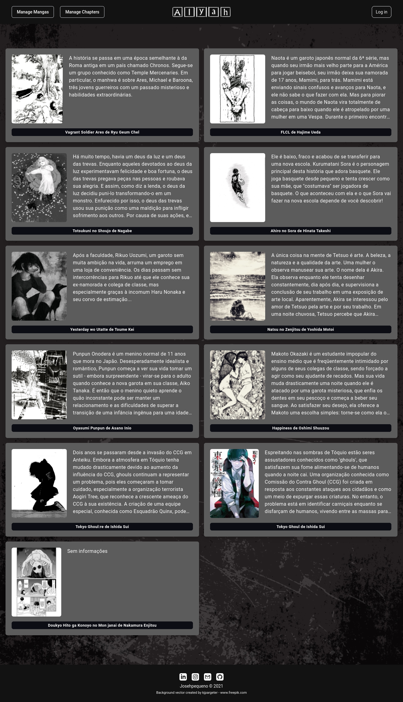

<p align="center">
<a href="https://github.com/Josehpequeno/Alyah-AdmFlask"></a>
</p>
<p align="center">Alyah Administrator</p>
<p align="center">


</p>
<p align="center">
 <a href="#Heroku">Heroku</a> •
 <a href="#Preview">Preview</a> •
 <a href="#Prerequisites">Prerequisites</a> • 
 <a href="#Back-End">Back-End</a> •
 <a href="#Technology">Technology</a>  
<!-- 
 <a href="#contribuicao">Contribuição</a> • 
 <a href="#licenc-a">Licença</a> • 
 <a href="#autor">Autor</a>-->
</p>
<h4 align="center"> 
	:construction: Work In Progress. :construction:
</h4>

### Heroku

<a href="https://alyah-admflask.herokuapp.com/">:link: Heroku</a>

### Preview
Current situation of the homepage.



### Prerequisites
Before you begin, you will need to have the following tools installed on your machine:
[Git] (https://git-scm.com), [Python] (https://www.python.org/), [Flask] (https://flask.palletsprojects.com/en/2.0.x/).
In addition, it is good to have an editor to work with the code like [VSCode] (https://code.visualstudio.com/)

### Back-End

```bash
# Clone this repository
$ git clone https://github.com/Josehpequeno/Alyah-AdmFlask.git

# Access the project folder in the cmd / terminal
$ cd Alyah-AdmFlask

# Install the dependencies
$ pip install psycopg2-binary
$ pip install python-dotenv
$ pip install Flask==2.0.2 Flask-Assets==2.0

# Run the application
$ python3 app.py

```

### Technology
- [Tailwindcss](https://tailwindcss.com/)
- [Flask](https://flask.palletsprojects.com/en/2.0.x/)
